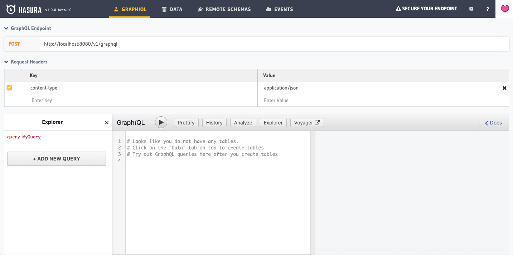

# Welcome

This example is based off [Quickstart with Docker](https://docs.hasura.io/1.0/graphql/manual/getting-started/docker-simple.html) from [Hasura.IO](https://hasura.io).

## Getting started

Assuming you are in the root directory of this project, all you need to run is:

```sh
$ npm run docker:hasura-docker-quickstart:up
```

You should be able to see the Hasura console up and running at [http://localhost:8080/console](http://localhost:8080/console):


